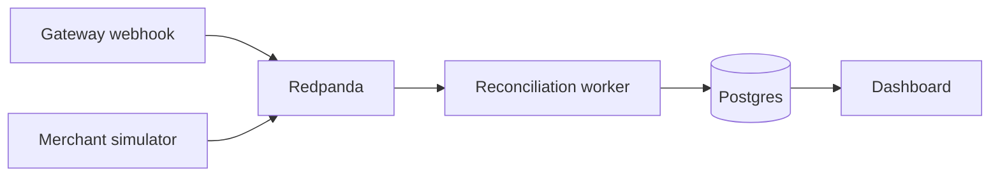
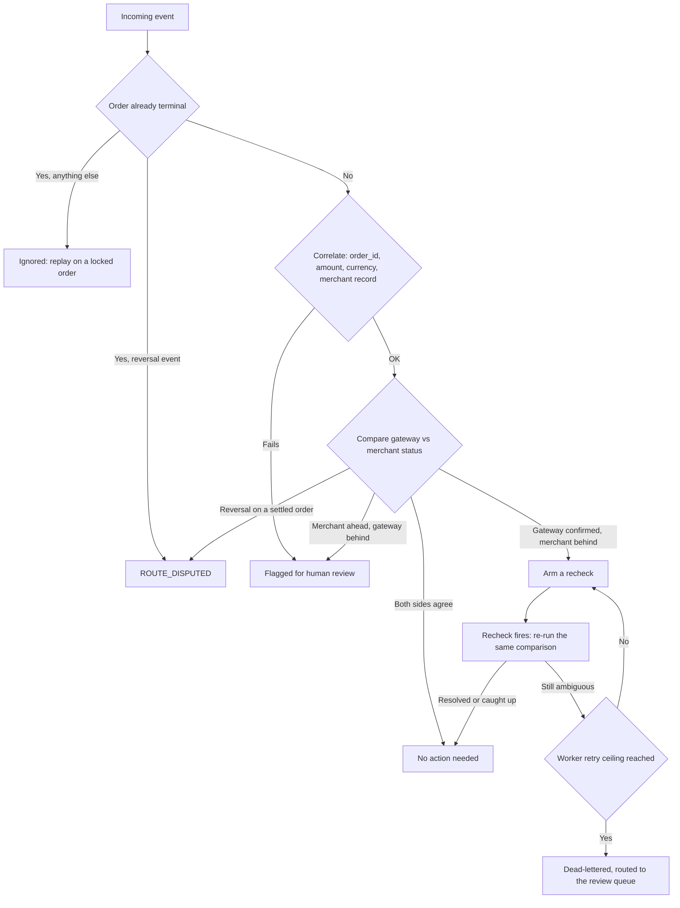

# Verisync

**Real-time reconciliation between a payment gateway's confirmed status and a merchant's own order record.**

    

---

## The problem

Payment gateways often reconcile the bank and their own systems internally. If a payment looks failed but the bank actually confirms it moments later, a good gateway catches that and flips the status on its own side. What no gateway can see is whether the merchant's own order database ever caught up with that correction.

This isn't hypothetical. A documented bug in a major e-commerce platform's official payment plugin shows exactly this: a successful renewal payment stayed marked pending in the merchant's own system, indefinitely, even though the gateway had already confirmed it succeeded. The webhook fired correctly. Nothing ever checked whether the merchant's side actually processed it.

Verisync is that missing check, built as a real, production-shaped system: an event-driven pipeline, not a batch job, with crash safety and idempotency treated as first-class requirements, not an afterthought.

## What it does

Two independent sources feed the same pipeline: the gateway's confirmed payment status, and the merchant's own order record. When they disagree, the system acts, but only in the direction that's safe to act on.

## The decision logic

| Gateway status | Merchant status | Correlation | Outcome | Action |
|---|---|---|---|---|
| any | any | no order_id at all | out of scope | Logged as a stat before it ever reaches the pipeline, no alert, this is routine traffic, not an anomaly |
| any | any | order_id present, fails validation | correlation failed | Routed to the review queue as a genuine anomaly |
| confirmed success | pending / behind | valid | safe drift | Arms a recheck, doesn't correct immediately |
| confirmed success (at recheck) | still behind | valid | still drifting | Auto-corrected |
| confirmed success (at recheck) | caught up on its own | valid | resolved naturally | No correction needed |
| confirmed success (at recheck) | no merchant record ever seen, or still ambiguous | valid | unresolved at recheck | Re-armed for another window rather than guessed at, bounded by a shared retry budget; once the ceiling is reached, dead-lettered and routed to the review queue instead of retried forever |
| confirmed failure | success | valid | risky drift | Flagged for human review only, never auto-corrected, this direction could mean fraud, not lag |
| reversal or chargeback | on an already-settled order | valid | disputed | Routes to a disputed state, breaks the terminal lock, never re-disputes an order already there |

Every comparison, correction, and gate in this table is deterministic Python. The decision layer makes no network calls and has no third-party dependencies at all, a dedicated test fails the build if it ever imports one.

## What makes this safe under real failure conditions

- **Dual idempotency.** A Postgres unique constraint on the event ID is the actual guarantee. A Redis key is a fast pre-filter in front of it, not the source of truth.
- **Atomic claim with a fencing token.** Before any recheck resolves, it claims the row with a fresh token. Completion checks that exact token, not just a status flag, so a worker that stalls past a timeout and finishes late can't silently overwrite a claim another worker already resolved.
- **Terminal states are locked, with a real way back open.** A settled order can't be silently reopened by a stale or duplicate event, but a genuine reversal still gets through and gets recorded, never dropped.
- **Bounded retries everywhere a loop could form.** A stuck claim gets reclaimed, but only up to a ceiling, after which it's dead-lettered for a human instead of retried forever.

## Verified, not just designed

- **A real chaos test.** The worker was killed mid-claim, no cleanup, matching an actual crash this machine had twice during the build. Recovery worked exactly as designed: the stuck claim was reclaimed, the fencing token prevented any double-execution, exactly one terminal action resulted.
- **A 150-order batch, run unattended over real elapsed time**, not sped up or forced:

| Outcome | Count |
|---|---|
| Resolved naturally | 63 |
| Auto-corrected | 72 |
| Dead-lettered | 15 |
| **Total** | **150** |

Every order landed exactly where the design predicted, including 39 late-arriving events correctly ignored against orders that had already resolved, the exact behavior the terminal lock exists to guarantee, now proven at scale instead of by hand.

## What's deliberately out of scope right now

This is a single-simulated-merchant system, not a multi-tenant platform. There's no tenant isolation, no per-merchant partitioning, no production merchant integration, the merchant side is a simulator built to reproduce realistic, imperfect update behavior, not a real store's database.

Real gateway test-mode webhooks were genuinely attempted, not skipped. Connecting them was blocked by account activation requiring bank verification on the gateway's side, confirmed independently through the webhooks API, the dashboard, and two separate tunnel services all producing the identical result. The signature-verification code itself is tested directly against the gateway's documented algorithm, including the raw-body-before-parsing requirement most integrations get wrong.

**A note on scope, honestly stated:** the reconciliation engine itself, correlation, comparison, and the decision rules, doesn't know or depend on which gateway sent an event, it's built as pure, gateway-agnostic logic. The ingestion layer, signature verification and payload parsing, is currently built against one real, specific gateway's documented webhook format. Extending it to a second provider would mean writing a new, small ingestion adapter, not touching the reconciliation logic itself.

## Tech stack

Python, Redpanda (Kafka-API-compatible), PostgreSQL, Redis, FastAPI, Docker Compose for local infrastructure.
